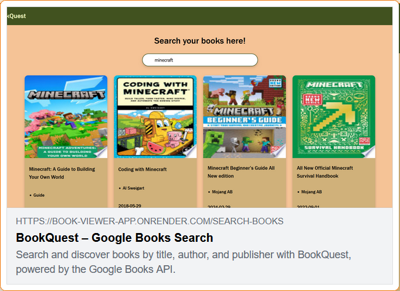

## Demo

## Social Media opengraph looks like:

## User Stories

- [x] User can enter a search query into an `input` field
- [x] User can submit the query. This will call an API that will return an array of books with the corresponding data (**Title**, **Author**, **Published Date**, **Picture**, etc)
- [x] User can see the list of books appearing on the page
- [x] Implement a 404 not found page

## Bonus features

- [x] For each item in the list add a link that will send the User to an external site which has more information about the book
- [x] Implement a Responsive Design
- [x] Add loading animations

## Note on AI Usage

I definitely used AI to help me speed up some processes such as styling the input field, adding the meta tags for social media og, and explaining any doubts that I had while styling the application as well as handling any errors and issues with calling the Google Books API. I only used AI to explain issues with my code, most of the code was handwritten by me. This is an attempt to make AI a walking stick, not a crutch for me to rely on. 

## Journal

### 28th January 2026 - 

Will clear out the unnecessary code, get the color palette and start desiging, will be using raw CSS for this, and split into components as needed. 

From the Google Books API, I'll only be working with the Volume? Which stores all the necessary information about a book matching a specific search term entered by a user. 

Hmm, issue with me exceeding the request for trying to check out the volumes. Okay I guess I have to create a google Books API key and append that to my requests. Okay I enabled the books api from the google cloud console and now I gotta confgure my API key. This should help me avoid any 429 errors. 

Okay I made a sample request using the google books api and the it works alhamdulillah and it gives me plenty of information to work with for this mini project. 

### 30th January 2026 - 

Okay going to commence now with the design and add stuff as I go. 

Following the user stories below, got it from [here](https://github.com/florinpop17/app-ideas/blob/master/Projects/2-Intermediate/Book-Finder-App.md) 

Downloaded the icons from the react so that I can get some free icons for the navbar. Just trying to implement this from scratch without AI generating (except for tiny snippets and guides). 

### 31st January 2026 - 

Trying to figure out a way to animate the dropdown on the navbar. Alhamdulillah I was finally able to figure out the dropdown menu based on the code I was checking out from other websites, it has to do with the manipulation of the max-height property and applying a transition to that property.

Okay I take that back found another bug where the navbar does not pop up properly, the text can still be seen. Okay I was able to fix it thanks to AI via the use of the overflow property set to hidden. If there is no space in the container, the contents of the container disappear.

Making the Footer and now need to fix the navbar logic, specifically the toggle stuff. 

Footer is complete and navbar is fixed.

Okay now I have to figure out the react router asap redirect user to another page to search for the books after entering the search query

### 3rd February 2026 -

First I have to set the max width property on my AI generated logo otherwise it just looks too big. 

### 5th February 2026 - 

Made a mistake in differentiating between Vite and Vue.js. Vite is just the build tool for building applications in quickly and Vue.js is a React framework. Now I gotta check the docs for the react router and figure it out to add the other pages on the navbar. Following W3 schools for this so let's see how far I can go with this. Okay the routes have been added and now to update the navbar with the Link tags.

Okay after reading the docs I added the routes for the home, contact, and about me pages. I also updated the navbar to use the Link tags, which are just a tags to be able to navigate between pages and also wrapped the Logo in the Link tag to navigate to the home page when clicked. 

Next is to update the contact page with the footer and header and then we proceed to the good part - rendering response from the api.

### 13th February 2026 - 

The Frontend and design is done. I'll work on the responsiveness for desktop screens laters. Finally I can implement the redirect and rerouting page to bring the user to a different page to searcht the books.

### 17th February 2026 -

So I kept trying to use the redirect function provided by react router dom and it was not working so I quickly searched it up and realized that I should be using the useNavigate function and route to the route that was set in the main.jsx.

### 18th February 2026 - 

Used AI to create the input field and add the search button inside of it. Almost done with this project. Initially I thought I was going to do useEffect and just call it a night and commit but useEffect is not good practice for large codebases or websites where users have to navigate multiple pages and you don't want them to sit through the same api call just to load data they have already seen. I see some interesting alternatives instead on the net so will implement one of those instead. 

### 20th February 2026 -

Added onKeyPress for the search bar, so it runs a function when the user presses enter. Completely forgot the syntax for fetch so using tutorials to figure it out quickly

### 21st February 2026 - 

Just realized that there is no need for the redux and caching since it will only make the call when the user types in the search and presses enter so no need for all this redux stuff. Spent time on trying to figure out the format of the object and how to access the fields that I need. Just learnt that the padding does not affect the bullet point of the li element but margin does. Padding affects only the text, and element, not the bullet point.

### 22nd February 2026 -

Gotta add loading state too. Now the response works and it is loading up the book cards but they are all different width, probably due to the image sizes. Will fix that too. Weird issue where even after typing the query and pressing enter, the first time is just returns an empty array and the second time I press enter it works. Gotta fix that. 

Now I finally realized that some of the entries do not even have an author, spent a lot of time stumped and only now realized to check the output of the api call.

Added the loader and was able to fix the issue with the missing fields by using optional chaining. 

Added hyperlinking for each book card. 

### 23rd February 2026 - 

The height of the cards vary wildyly so need to fix that. Also need to add wrapping and text clipping so that visually the cards look consistent.

Decided to add event listener to each div since it is causing issues with the CSS when I use the a element. Used window.open method instead. 

Okay let me implement a 404 not found page

Now on to deployment, finally

24th February 2026 - 

Dployed on Render and used AI to add some social media of meta tags for visibility

